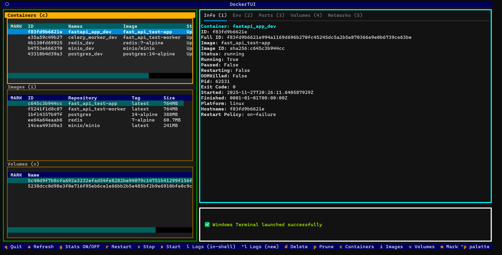
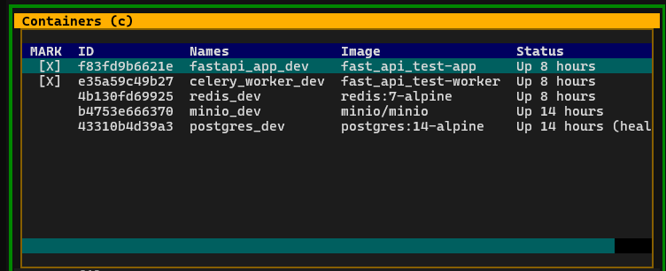
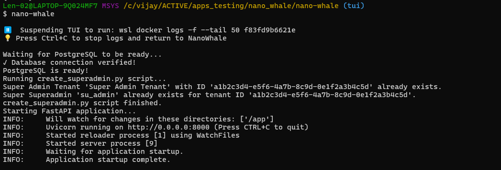
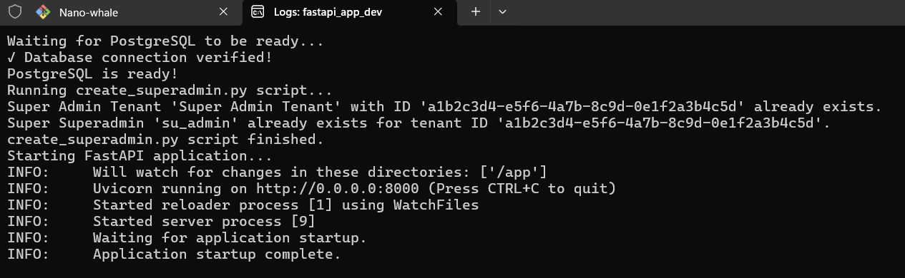
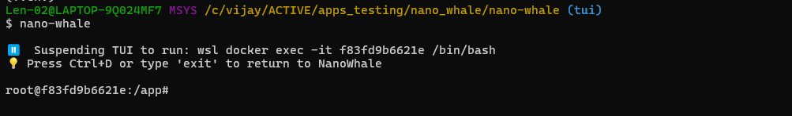
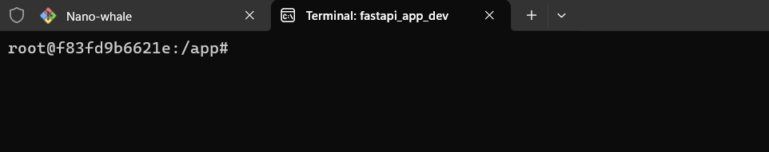
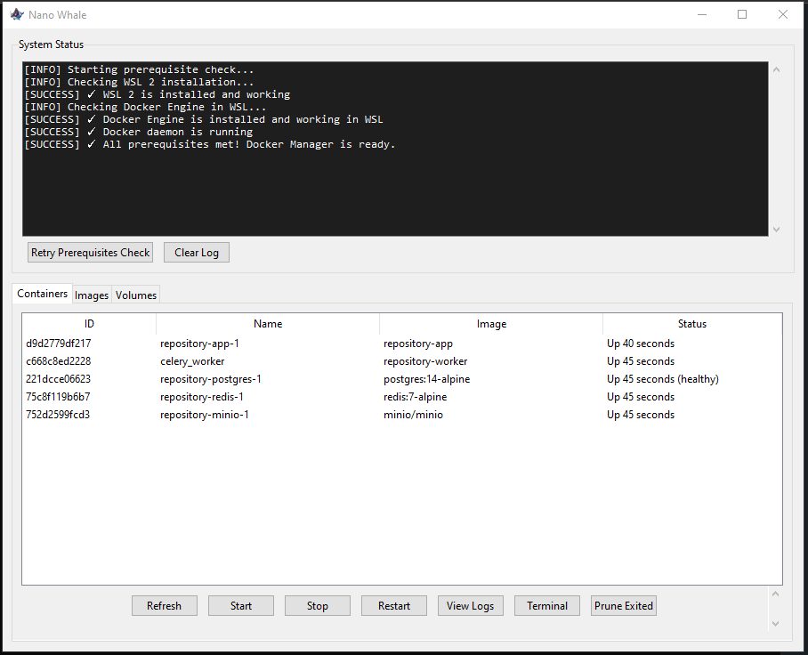
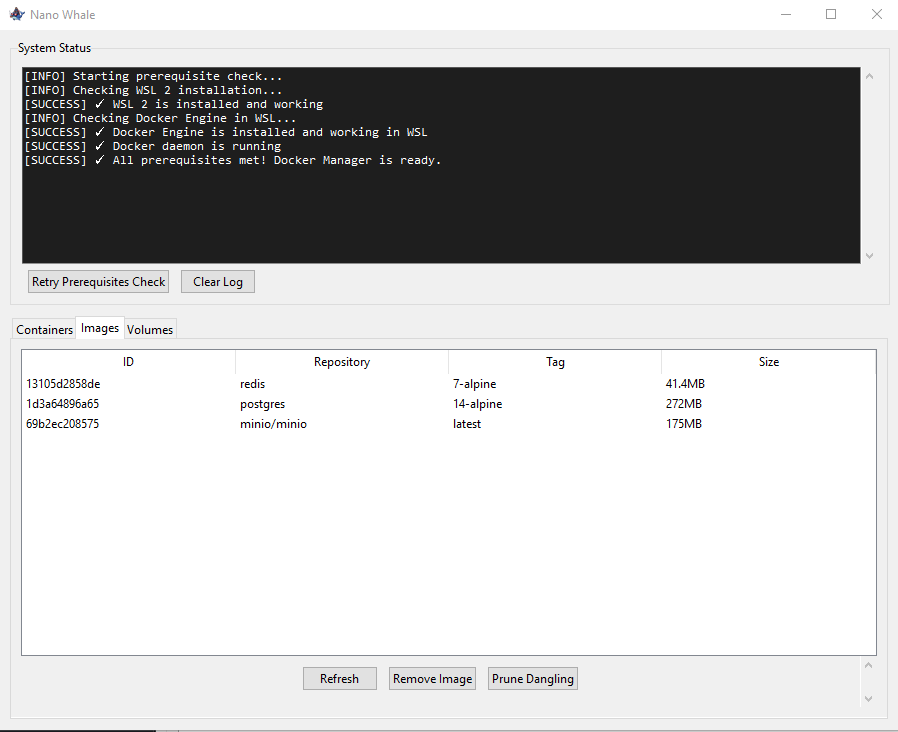
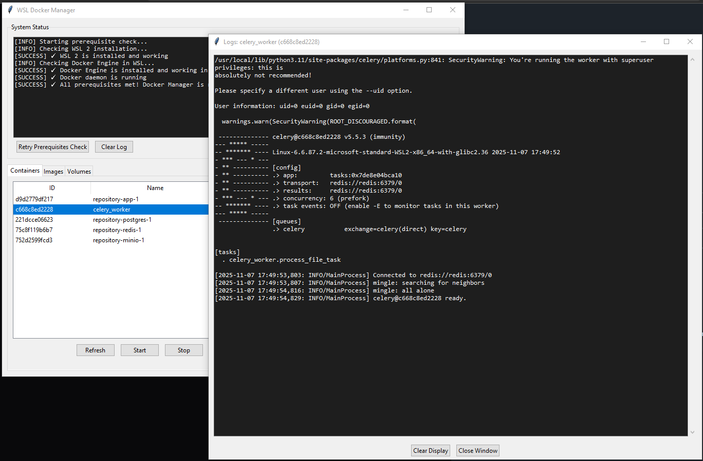

# 🐳 Nano Whale - Lightweight Docker TUI
[](https://www.python.org/downloads/)
[](LICENSE)
[](https://textual.textualize.io/)

<p align="center">
  
</p>

> ⚠️ **DEPRECATION NOTICE**: The original Tkinter GUI version of Nano Whale has been deprecated. This repository now contains the new and improved **Terminal User Interface (TUI)** version built with Textual. For the legacy version, see the `legacy-tkinter` branch.

**STOP!** Before you go any further... are you tired of the lag, the CPU spikes, and the general bulk of Docker Desktop?

Meet **Nano Whale TUI**! A blazingly fast, lightweight **Terminal User Interface** for managing Docker containers, images, and volumes via WSL2. Built with [Textual](https://textual.textualize.io/), Nano Whale provides an elegant, keyboard-driven interface for Docker management without the overhead of Docker Desktop.

---

## ✨ Features

### 🖥️ Split-Pane Interface
- **Left Pane**: Three stacked tables showing Containers, Images, and Volumes simultaneously
- **Right Pane**: Detailed view with 5 tabbed panels for container inspection
- **Bottom Panel**: Real-time log output and status messages

### 📦 Container Management
- Start, stop, and restart containers
- View container logs (in-shell or new terminal window)
- Launch interactive terminal sessions (exec into containers)
- Delete containers with safety checks

### 🖼️ Image Management
- View all Docker images with size and creation info
- Delete unused images
- Multi-select for batch deletion

### 💾 Volume Management
- List all Docker volumes
- Delete volumes (with force option)
- Batch operations support

### 🔍 Container Inspection (Right Pane Tabs)
| Tab | Content |
|-----|---------|
| **Info (1)** | Container ID, Image, Status, PID, Exit Code, Platform, Hostname, Restart Policy |
| **Env (2)** | All environment variables |
| **Ports (3)** | Port mappings (host → container) |
| **Volumes (4)** | Volume mounts with source, destination, and mode |
| **Networks (5)** | Network configuration, IP addresses, gateways, MAC addresses |

### ⚡ Additional Features
- 🚀 **Lightning Fast** - Minimal resource footprint, native WSL2 integration
- ⌨️ **Keyboard-Driven** - Full keyboard navigation
- 🖱️ **Mouse Support** - Click anywhere on a table section to switch
- 📦 **Multi-Select** - Batch operations on multiple items
- 🔄 **Auto-Refresh** - Manual refresh with `A` key
- 🧹 **Smart Prune** - Two-step confirmation for system cleanup
- 🎨 **Visual Feedback** - Highlighted labels show active table
- 🌐 **Cross-Platform** - Windows (WSL), Linux, macOS support

---

## 🖼️ Screenshots

### Main Interface
<p align="center">
  
</p>

### Multi-Select Mode
<p align="center">
  
</p>

### Commands Panel
<p align="center">
  
</p>

---

## 🎯 Why Nano Whale TUI?

Tired of Docker Desktop's resource consumption? Nano Whale gives you:

- **No GUI Overhead** - Terminal-based means minimal memory usage
- **WSL2 Native** - Direct integration with Docker Engine in WSL2
- **Keyboard Efficiency** - Faster than clicking through GUI menus
- **SSH-Friendly** - Works perfectly over SSH connections
- **Open Source** - Free and community-driven

---

## 📋 Prerequisites

- **Windows 10/11** with WSL2 installed
- **Docker Engine** running in WSL2 (not Docker Desktop)
- **Python 3.8+**

### Platform Support

| Platform | Docker Command |
|----------|---------------|
| Windows (WSL2) | `wsl docker ...` |
| Linux | `docker ...` |
| macOS | `docker ...` |

---

### Quick WSL2 & Docker Setup

If you don't have WSL2 and Docker Engine set up:

```bash
# Install WSL2
wsl --install

# After restart, install Docker in WSL
wsl
sudo apt update
sudo apt install docker.io -y
sudo service docker start
```

---

## 📦 Installation

### Via pip (Recommended)

```bash
pip install nano-whale
```

### Via pipx (Isolated)

```bash
pipx install nano-whale
```

### From Source

```bash
git clone https://github.com/Vriddhachalam/nano-whale.git
cd nano-whale
pip install -e .
```

---

## 🚀 Usage

Simply run:

```bash
nano-whale
```

Or run directly:

```bash
python main.py
```

---

## ⌨️ Keyboard Shortcuts

### Table Navigation
| Key | Action |
|-----|--------|
| `C` | Switch to **Containers** table |
| `I` | Switch to **Images** table |
| `V` | Switch to **Volumes** table |
| `↑/↓` | Navigate rows |
| `Page Up/Down` | Fast scroll |
| `Home/End` | Jump to first/last row |
| **Mouse Click** | Click anywhere on table section to switch |

### Detail Panel Tabs
| Key | Action |
|-----|--------|
| `1` | **Info** tab - Container details |
| `2` | **Env** tab - Environment variables |
| `3` | **Ports** tab - Port mappings |
| `4` | **Volumes** tab - Volume mounts |
| `5` | **Networks** tab - Network configuration |

### Container Operations
| Key | Action |
|-----|--------|
| `S` | **Start** container(s) |
| `X` | **Stop** container(s) |
| `R` | **Restart** container(s) |
| `D` | **Delete** selected item(s) |

### Logs & Terminal
| Key | Action |
|-----|--------|
| `L` | View **Logs** in-shell (suspends TUI) |
| `Ctrl+L` | View **Logs** in new terminal window |
| `T` | Launch **Terminal** in-shell (exec) |
| `Ctrl+T` | Launch **Terminal** in new window |

### Multi-Select & Batch Operations
| Key | Action |
|-----|--------|
| `M` | **Mark/Unmark** current item |
| *(then)* `S/X/R/D` | Perform action on all marked items |

### Utilities
| Key | Action |
|-----|--------|
| `A` | **Refresh** all tables |
| `G` | Toggle **Stats** display in container list |
| `P` | **Prune** menu (press twice to confirm) |
| `Q` | **Quit** application |

---

## 🖥️ Terminal Talk: Docker Commands via WSL

Since Nano Whale manages Docker via WSL 2, the standard docker command is no longer available directly in your regular Windows Command Prompt or PowerShell.

To run manual Docker commands in your Windows (git bash/cmd/powershell) terminal, you must simply prefix them with `wsl`:

| Instead of (Old Way) | Use (New Nano Whale Way) |
| ------------- | ------------- |
| `docker ps` | `wsl docker ps` |
| `docker images` | `wsl docker images` |
| `docker run ...` | `wsl docker run ...` |

## 📖 Usage Examples

### Viewing Container Details

1. Launch Nano Whale: `nano-whale`
2. First container is automatically selected and details shown
3. Press `1-5` to switch between Info, Env, Ports, Volumes, Networks tabs
4. Use `↑/↓` to select different containers

### Starting Multiple Containers

1. Press `C` to ensure Containers table is focused
2. Press `M` on first container to mark it `[*]`
3. Press `↓` then `M` to mark more containers
4. Press `S` to start all marked containers

### Viewing Live Logs

**In-Shell (suspends TUI):**
1. Select a running container
2. Press `L`
3. Logs stream in terminal
4. Press `Ctrl+C` to return to TUI

<p align="center">
  
</p>

**In New Window:**
1. Select a running container
2. Press `Ctrl+L`
3. New terminal window opens with streaming logs
4. TUI remains active

<p align="center">
  
</p>

### Exec into Container

**In-Shell:**
1. Select a running container
2. Press `T`
3. Interactive shell opens
4. Type `exit` to return to TUI

<p align="center">
  
</p>

**In New Window:**
1. Select a running container
2. Press `Ctrl+T`
3. New terminal with shell opens

<p align="center">
  
</p>

### Cleaning Up System

1. Press `P` - shows warning notification
2. Press `P` again within 5 seconds to confirm
3. Executes `docker system prune -a -f`
4. Removes all unused containers, images, and volumes

### Switching Between Tables

**Keyboard:**
- `C` → Containers
- `I` → Images  
- `V` → Volumes

**Mouse:**
- Click anywhere within a table's border area


**Key Benefits:**
- ✅ No Docker Desktop required
- ✅ Direct Docker Engine access
- ✅ Minimal overhead
- ✅ Works over SSH

---

## 🔧 Configuration

Nano Whale auto-detects your platform:

| Platform | Detection | Command Prefix |
|----------|-----------|----------------|
| Windows + WSL | `wsl` available | `wsl docker` |
| Windows (native) | No WSL | `docker` |
| Linux | `platform.system()` | `docker` |
| macOS | `platform.system()` | `docker` |

---

## 💻 Dev Zone: Running from Source

### Development Setup

```bash
# Clone the repository
git clone https://github.com/Vriddhachalam/nano-whale.git
cd nano-whale

# Create virtual environment
python -m venv .venv
.venv\Scripts\activate  # On Windows
# source .venv/bin/activate  # On Linux/macOS

# Install dependencies
pip install -r requirements.txt

# Install in development mode
pip install -e .

# Run from source
python main.py
```

### 📦 Building Portable Executable with Nuitka

Want to create a standalone `.exe` that doesn't require Python installed? Use [Nuitka](https://nuitka.net/)!

**Prerequisites:**
- Python 3.8+
- C compiler (MinGW on Windows, GCC on Linux)
- Nuitka (`pip install nuitka`)

**Build Command:**

```bash
# Windows - Build standalone exe
python -m nuitka --standalone --onefile --enable-plugin=tk-inter --windows-console-mode=force --output-filename=nano-whale.exe main.py

# Linux/macOS - Build standalone binary
python -m nuitka --standalone --onefile --output-filename=nano-whale main.py
```

**Build Options Explained:**
| Option | Description |
|--------|-------------|
| `--standalone` | Include all dependencies |
| `--onefile` | Package everything into a single executable |
| `--enable-plugin=tk-inter` | Include Tkinter support (if needed) |
| `--windows-console-mode=force` | Keep console window for TUI |
| `--output-filename` | Name of the output executable |

**Output:**
- Windows: `nano-whale.exe` (~15-25 MB)
- Linux/macOS: `nano-whale` binary

The portable executable can be distributed and run on any compatible system without Python installation!

---

## 🐛 Troubleshooting

### "wsl command not found" (Windows)

```bash
wsl --install
# Restart computer after installation
```

### "Cannot connect to Docker daemon"

**Linux/macOS:**
```bash
sudo systemctl start docker
# or
sudo service docker start
```

**Windows WSL:**
```bash
wsl sudo service docker start
```

### "Permission denied"

```bash
sudo usermod -aG docker $USER
# Then log out and back in
```

### Terminal commands not opening new windows

Nano Whale tries multiple terminal emulators:
- **Windows**: Windows Terminal (`wt.exe`), `cmd.exe`
- **Linux**: `gnome-terminal`, `konsole`, `xfce4-terminal`, `xterm`
- **macOS**: Terminal.app, iTerm2

Ensure at least one is installed and accessible in PATH.

---

## 🤝 Contributing

Contributions are welcome! Please feel free to submit a Pull Request.

```bash
# Clone
git clone https://github.com/Vriddhachalam/nano-whale.git
cd nano-whale

# Setup
python -m venv .venv
source .venv/bin/activate  # Windows: .venv\Scripts\activate
pip install -e .

# Run
python main.py
```

---

## 📜 License

This project is licensed under the MIT License - see the [LICENSE](LICENSE) file for details.

---

## 🙏 Acknowledgments

- Built with [Textual](https://textual.textualize.io/) by Textualize.io
- Inspired by lazydocker and the need for a lightweight Docker Desktop alternative
- Thanks to the Docker and WSL2 teams for their excellent tools

---

## 📞 Support

- **Issues**: [GitHub Issues](https://github.com/Vriddhachalam/nano-whale/issues)
- **Discussions**: [GitHub Discussions](https://github.com/Vriddhachalam/nano-whale/discussions)
- **Email**: svriddhachalam@gmail.com

---

## 📚 Migration from Legacy GUI Version

If you're upgrading from the old Tkinter GUI version:

1. **No more .exe**: The new TUI version runs directly with Python
2. **Keyboard-driven**: Learn the keyboard shortcuts for faster workflow
3. **Better performance**: Even lighter resource usage than before
4. **SSH compatible**: Now works over remote connections
5. **New features**: Split-pane interface, container inspection tabs, multi-select

The legacy Tkinter version can still be found in the `legacy-tkinter` branch, but it will no longer receive updates.

### Legacy Version Screenshots (Deprecated)

<p align="center">
  
</p>
<p align="center">
  
</p>
<p align="center">
  
</p>
<p align="center">
  
</p>

---

## ⭐ Star History

If you find Nano Whale useful, please consider giving it a star on GitHub!

---

**Made with ❤️ by Vriddhachalam S**

*Swim fast, stay light! 🐳*
